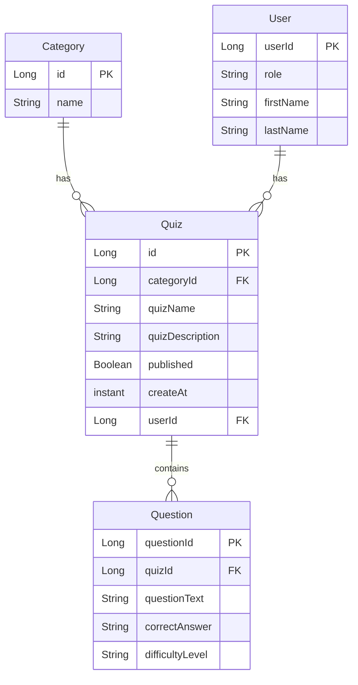

# Quizzer
A dashboard application where the teacher can manage quizzes. 
This application provides an opportunity for the teacher to list, create, delete, edit and mark 
a status for the quizzes and questions.  Additionally, the app includes authentication functionality, 
allowing the teachers and students to sign up, log in, and access secure pages based on their roles.

## Team members:
- [Denis Chuvakov](https://github.com/DenisHki "Github page")
- [Maksim Minenko](https://github.com/madaraDance "Github page")
- [Phat Trong Nguyen](https://github.com/padwhen "Github page")
- [Tatiana Lyubavskaya](https://github.com/lTanjal "Github page")
- [Un Kuan Che](https://github.com/arielunkuanche "Github page")

## Documentation:
- [Project Board](https://github.com/orgs/https-github-com-DenisHki/projects/1)
- [Swagger Documentation](https://quizzer-app.onrender.com/swagger-ui/index.html)

## Developer guide:
**1. How to start the application**

1. The project uses Spring Boot version 3, which requires Java version 17 or higher. Before you begin, you should check your current Java installation by running the following command: **$ java -version**.
2. Start the application by running: **./mvnw spring-boot:run** command on the command-line in project folder. 
3. To stop the application running simply press *Ctrl+C* in your terminal.
4. Or you can install Maven to run the application in your IDE. Spring Boot is compatible with Apache Maven 3.6.3 or later, you can follow the instructions at [maven.apache.org](https://maven.apache.org/). 
5. Once the application has started, visit [http://localhost:8080](http://localhost:8080) in a web browser to use the application.

**2. How to generate and run the application using the JAR file**

1. Generate a JAR file by running **./mvnw package** in the terminal.
2. Check for your project root folder, under the target folder, you can find JAR file: **quizzer-0.0.1-SNAPSHOT.jar**.
3. You should now to stop your IDE running status of the application.
4. Then run command: **java -jar target/quizzer-0.0.1-SNAPSHOT.jar** to run the application with the JAR file.
5. Open the application in [http://localhost:8080](http://localhost:8080).

**3. URL of the backend application**

<https://quizzer-app.onrender.com/>

**4. The purpose of the project’s branches**

- **Isolation of Work** :Team members to work on different features or bug fixes without interfering with each other's work.
- **Parallel Development** :Team members to work on different tasks simultaneously. This can significantly speed up the development process.
- **Code Review** :Team members can review each other's changes in a dedicated branch before merging them into the main codebase. And to resolve conflicts that may arise when multiple team members make changes to the same files.
- **Backup and Recovery** :If something goes wrong, team members can revert to a previous branch or commit to recover lost work.

## Data Model:
### Entity Relationship Diagram

### Description:

#### Category
The Category entity represents different categories that quizzes can belong to. Each category can have zero or many quizzes associated with it.

#### Quiz
The Quiz entity represents individual quizzes within the application. Each quiz belongs to exactly one category, facilitated by the categoryID foreign key. Additionally, each quiz can have multiple questions associated with it. A quiz is also associated with a user who created it using the userID foreign key. Other attributes include quizName, quizDescription, published, createdAt, which provide details about the quiz.

#### Question
The Question entity represents individual questions within quizzes. Each question belongs to exactly one quiz, facilitated by the quizId foreign key. The Question entity includes attributes such as Id, questionText, correctAnswer, and difficultyLevel, which provide details about the question.

#### User
The User entity represents individuals who interact with the application. Users can have two roles: teacher and student. Users with the role of teacher can create quizzes, while users with the role of student can take quizzes. Each user can have zero or many quizzes. The User entity also includes attributes such as userId, userName, role, firstName, and lastName.

